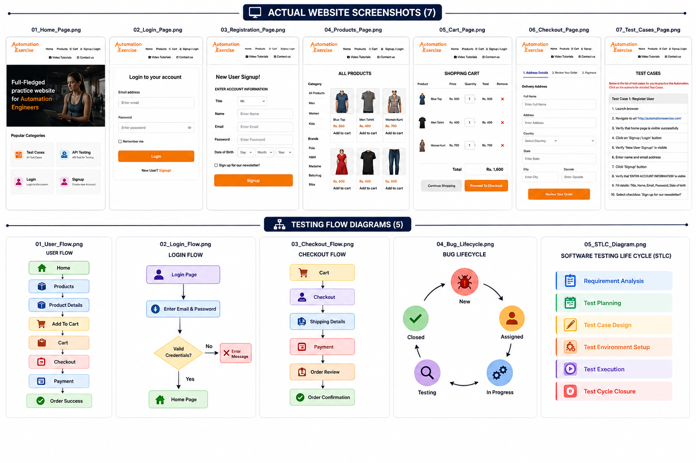

<div align="center">

# 🧪 E-Commerce Manual Software Testing Portfolio

### Manual QA • STLC • Test Documentation • Bug Reporting • Requirement Traceability


A complete Manual Software Testing portfolio for an E-Commerce web application.

</div>

---

# 📸 Portfolio Preview

The image below provides a quick overview of the project, including the tested website, testing flow diagrams, and high-fidelity mock UI screens.

<p align="center">

</p>

---

# 📖 Project Overview

This repository demonstrates the complete **Software Testing Life Cycle (STLC)** for an E-Commerce web application.

The project covers requirement analysis, test planning, test scenario design, test case creation, execution documentation, bug reporting, requirement traceability, and final testing summary.

---

# ⭐ Project Highlights

- ✅ Requirements Documentation
- ✅ User Stories
- ✅ Acceptance Criteria
- ✅ Test Plan
- ✅ Test Scenarios
- ✅ Manual Test Cases
- ✅ Requirement Traceability Matrix (RTM)
- ✅ Bug Reports
- ✅ Test Summary Report
- ✅ Website Screenshots
- ✅ Testing Flow Diagrams
- ✅ High-Fidelity Mock UI
- ✅ Reusable QA Templates

---

# 🧩 Modules Covered

- Authentication
- Registration
- Products
- Search
- Shopping Cart
- Checkout
- Contact Us

---

# 📂 Repository Structure

```text
.
├── assets
│   └── portfolio-preview.png
│
├── docs
│   ├── Acceptance_Criteria
│   ├── Bug_Reports
│   ├── Lessons_Learned
│   ├── Requirements
│   ├── RTM
│   ├── Test_Cases
│   ├── Test_Plan
│   ├── Test_Scenarios
│   ├── Test_Summary
│   └── User_Stories
│
├── screenshots
│   ├── 01_Home_Page.PNG
│   ├── 02_Login_Page.PNG
│   ├── 03_Registration_Page.PNG
│   ├── 04_Products_Page.PNG
│   ├── 05_Cart_Page.PNG
│   ├── 06_Checkout_Page.PNG
│   └── 07_Test_Cases_Page.PNG
│
├── templates
│   ├── Bug_Report_Template.xlsx
│   ├── RTM_Template.xlsx
│   └── Test_Case_Template.xlsx
│
└── README.md
```

---

# 📋 Documentation Included

- Requirements
- User Stories
- Acceptance Criteria
- Test Plan
- Test Scenarios
- Manual Test Cases
- Requirement Traceability Matrix (RTM)
- Bug Reports
- Test Summary Report
- Reusable QA Templates

---

# 🧪 Testing Techniques

- Positive Testing
- Negative Testing
- Boundary Value Analysis (BVA)
- Equivalence Partitioning (EP)
- Error Guessing

---

# 📸 Website Screenshots

The repository includes screenshots captured during testing of the Automation Exercise website.

Available screenshots:

- Home Page
- Login Page
- Registration Page
- Products Page
- Shopping Cart
- Checkout Page
- Test Cases Reference

All screenshots are available in the **screenshots** folder.

---

# 📁 Templates Included

- Test Case Template
- Bug Report Template
- RTM Template

These templates can be reused in future Manual Testing projects.

---

# 🛠 Tools Used

- Microsoft Excel
- Visual Studio Code
- Git
- GitHub
- Markdown
- Automation Exercise

---

# 🚀 Future Improvements

- Selenium WebDriver (Java)
- TestNG
- Maven
- Page Object Model (POM)
- API Testing using Postman
- Jira
- CI/CD Integration

---

<div align="center">

⭐ If you found this repository useful, feel free to leave a Star.

</div>