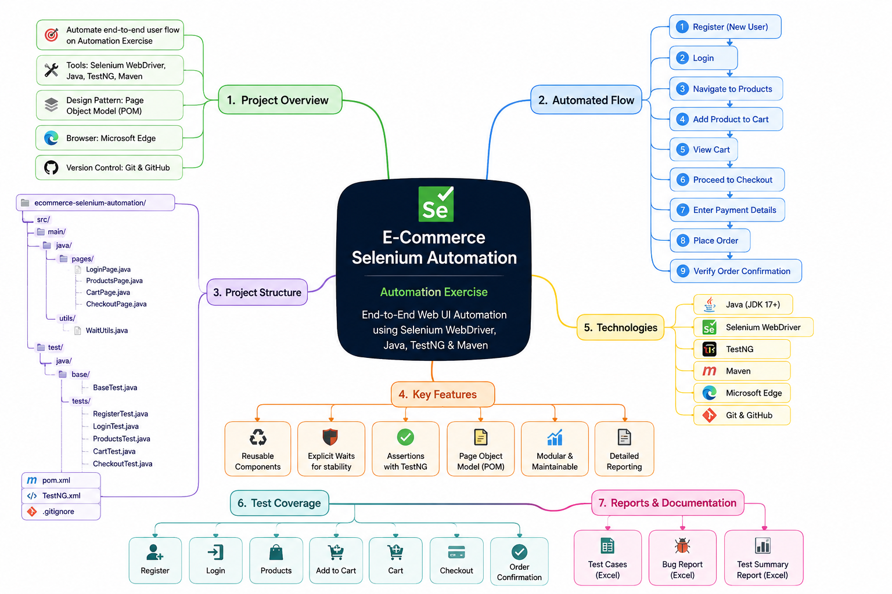

# 🛒 E-Commerce Selenium Automation

A beginner-friendly **UI Test Automation Framework** built with **Java,
Selenium WebDriver, TestNG, and Maven**.

The project automates the main e-commerce journey on **Automation
Exercise** using the **Page Object Model (POM)**.

> **Register → Login → Products → Cart → Checkout → Order Confirmation**

------------------------------------------------------------------------

## 🚀 Tech Stack

-   **Java**
-   **Selenium WebDriver**
-   **TestNG**
-   **Maven**
-   **Microsoft Edge**
-   **Page Object Model (POM)**
-   **Extent Reports**
-   **Git & GitHub**

------------------------------------------------------------------------

## 🏗️ Framework Architecture

The framework is divided into clear layers:

``` text
                    TestNG Test Classes
                           │
                           ▼
                    ┌──────────────┐
                    │   BaseTest   │
                    └──────┬───────┘
                           │
                           ▼
                    ┌──────────────┐
                    │ Page Objects │
                    └──────┬───────┘
                           │
          ┌────────────────┼────────────────┐
          ▼                ▼                ▼
      LoginPage       ProductsPage      CartPage
          │                │                │
          └────────────────┼────────────────┘
                           ▼
                     CheckoutPage
                           │
                           ▼
                    Web Application
```

The framework separates **test logic, page actions, and reusable
utilities** to keep the automation maintainable.

------------------------------------------------------------------------

## 🧪 Automated Test Scenarios

  Test       Coverage
  ---------- ------------------------------------------
  Register   User registration
  Login      Valid user login
  Products   Products navigation & add to cart
  Cart       Cart validation
  Checkout   End-to-end checkout & order confirmation

### Main Flow

``` text
Register
   ↓
Login
   ↓
Products
   ↓
Add to Cart
   ↓
Cart
   ↓
Checkout
   ↓
Order Confirmation
```

------------------------------------------------------------------------

## 📊 Test Documentation

QA documentation is available in the `reports/` directory:

-   📋 **Test Cases** --- `reports/Test_Cases.xlsx`
-   🐞 **Bug Report** --- `reports/Bug_Report.xlsx`
-   📈 **Test Summary** --- `reports/Test_Summary.xlsx`

------------------------------------------------------------------------

## 🎥 Test Evidence

### Checkout Automation

The following recording demonstrates the automated end-to-end checkout
flow:

**Login → Products → Add to Cart → Cart → Checkout → Order
Confirmation**

[▶️ Watch Checkout Test Recording](screenshots/checkout-test.mp4)

### Project Mind Map



